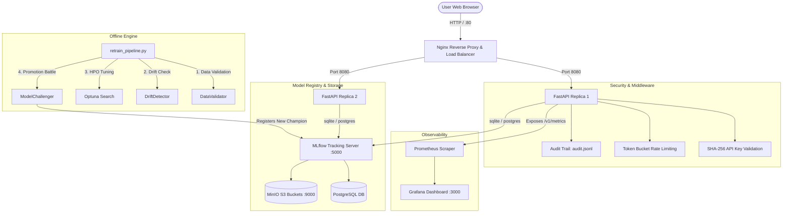

# 🌌 Nexus AI: End-to-End Production MLOps & Predictive Pipeline

Welcome to **Nexus AI**, a state-of-the-art, production-grade Machine Learning Operations (MLOps) system. It combines a dynamic Web Dashboard with robust data validation, drift detection, hyperparameter tuning, champion-challenger model battles, security auditing, and live Prometheus/Grafana observability.

---

## 🏗️ System Architecture

Nexus AI is designed to support two execution topologies: a **Local Developer Mode** (zero-dependency, SQLite-backed) and a **Production Docker Cluster Mode** (highly available, distributed).



---

## 💎 The Four MLOps Pillars

### 1. Data Quality & Feature Preprocessing
* **Unified sklearn Pipeline**: To prevent training-serving skew, all raw feature inputs are processed using an inline `Pipeline` containing `SimpleImputer` and `StandardScaler` joined directly with the classifier. Imputation and scaling parameters are serialized inside the model artifact rather than applied ad-hoc.
* **Strict Validation (`src/data_validator.py`)**: Before training or retraining, datasets must pass:
  - **Schema Check**: Validates the presence of exactly 10 features (`feat_01` to `feat_10`) of type `numeric`.
  - **Label Check**: Enforces a binary target class label (`0` or `1`).
  - **Null Audit**: Ensures no single feature contains more than 5% missing values.
  - **Class Balance**: Fails if the minority class size falls below a 20% ratio.
  - **Duplication & Size Audits**: Validates dataset uniqueness and minimum length.
* **Drift Detection (`src/drift_detector.py`)**: Computes **Population Stability Index (PSI)**, **Kolmogorov-Smirnov (KS) tests**, and **Jensen-Shannon (JS) Divergence** to alert on feature distribution shifts.

### 2. Model Tracking & Registry (Metadata Vault)
* **MLflow Backend**: Model training, metrics, and parameters are tracked within MLflow runs.
* **SQL Registry**: Configured to run on SQLite locally (`sqlite:///mlflow.db`) and PostgreSQL in production to ensure ACID compliance.
* **Optuna Search (`src/optuna_search.py`)**: Runs Bayesian hyperparameter optimization sweeps, logging trial parameters directly to MLflow child runs.

### 3. Challenger-Champion Battles & Automated Promotion
* **Battle Evaluation (`src/model_challenger.py`)**: When new models are trained, they battle the active production champion:
  - **F1 Bootstrapping**: Simulates 1,000 bootstrap iterations to calculate F1-score confidence intervals.
  - **McNemar's Test**: Determines if accuracy gains are statistically significant ($p < 0.05$).
  - **Latency Benchmarking**: Confirms the new model matches or improves on the inference time limit.
* **Promotion Threshold**: The challenger is promoted to `Production` in the MLflow Model Registry only if its F1-score exceeds the champion's by a configured margin (default $+0.01$) and passes statistical tests.

### 4. Production Observability & Monitoring
* **Structured JSON Logging**: Logs events in structured JSON lines for easy indexing.
* **FastAPI Security Middleware**:
  - **API Token Verification**: Validates requests using SHA-256 hashes of API tokens.
  - **Rate Limiting**: Limits keys to 100 requests per minute to prevent abuse.
  - **Input Sanitization**: Filters out extreme values, `NaN`, and `inf` ranges.
  - **Audit Trails**: Logs timestamp, key prefix, endpoint, status, and latency to `audit.jsonl`.
* **Telemetry Gauges**: Exposes Prometheus metrics at `/v1/metrics`:
  - `prediction_requests_total` (counts served predictions)
  - `prediction_latency_seconds` (histogram of response times)
  - `feedback_accuracy_percentage` (live rolling model accuracy from user correctness feedback submissions)
  - `drift_psi_score` (exposes drift scores dynamically)

---

## 🚀 Quick Start Guide

### Option A: Local Developer Mode
Perfect for rapid local testing and debugging.

1. **Install Dependencies**:
   ```bash
   python setup.py
   ```
   This automatically installs all requirements and registers the initial MLflow experiment namespace.

2. **Start the Project**:
   ```bash
   .\start_project.bat
   ```
   This sets up default API credentials and launches the Uvicorn web server locally at `http://localhost:8000`.

3. **Explore the Interface**:
   - Open [http://localhost:8000](http://localhost:8000) in your web browser.
   - Use the **Security Vault** tab to configure your access token (defaults to `my-secret-key`).
   - Train a new model by selecting a CSV file in the **Model Factory** panel.
   - Test predictions and submit feedback to watch the **Rolling Accuracy Gauge** dynamically adjust.

---

### Option B: Production Docker Cluster Mode
Spins up a fully load-balanced API cluster with dedicated MLflow, Postgres, MinIO, Prometheus, and Grafana instances.

1. **Build and Deploy**:
   ```bash
   docker-compose up --build -d
   ```

2. **Access Points**:
   * **Web Application (Nginx load-balanced)**: [http://localhost/](http://localhost/)
   * **MLflow Tracking Dashboard**: [http://localhost:5000/](http://localhost:5000/)
   * **MinIO Object Storage Console**: [http://localhost:9001/](http://localhost:9001/) (credentials in `.env`)
   * **Prometheus Status Panel**: [http://localhost:9090/](http://localhost:9090/)
   * **Grafana Dashboards**: [http://localhost:3000/](http://localhost:3000/)

---

## 🔌 API Reference

| Endpoint | Method | Security | Description |
| :--- | :--- | :--- | :--- |
| `/` | `GET` | None | Serves the interactive user dashboard. |
| `/v1/ready` | `GET` | None | Returns `200 OK` once the active model has finished loading into memory. |
| `/v1/health` | `GET` | None | System uptime, loaded model metadata, and latency. |
| `/v1/predict` | `POST` | `X-API-Key` | Generates a model prediction on a 10-feature raw array. |
| `/v1/feedback`| `POST` | `X-API-Key` | Receives ground-truth values and updates rolling accuracy telemetry. |
| `/v1/metrics` | `GET` | None | Serves standard Prometheus metrics format. |

### Prediction Request Payload (`POST /v1/predict`)
```json
{
  "features": [0.5, 1.2, 0.1, -0.5, 0.0, 1.0, 2.0, -1.0, 0.5, -0.2]
}
```

### Response Payload
```json
{
  "prediction": 1,
  "probability": 0.874,
  "model_version": "4",
  "request_id": "c1f72922-38e9-4e78-8316-4351df9aa8ab"
}
```

---

## 🧪 Testing & Verification

To verify that the entire pipeline is operational, run the test suites:

* **Unit & Integration Tests**:
  ```bash
  pytest
  ```
* **End-to-End QA Validation (Stress Test)**:
  ```bash
  python test_fastapi.py
  ```

---

## 📂 Repository Structure

```
├── app/
│   ├── static/          # HTML/CSS/JS frontend dashboard
│   ├── main.py          # FastAPI application server & routes
│   ├── middleware.py    # Security, Rate Limiter, and Audit logs
│   ├── metrics.py       # Prometheus client registration
│   ├── model_loader.py  # Thread-safe MLflow model loader
│   └── schemas.py       # Pydantic request/response validation
├── src/
│   ├── data_validator.py# Schema and quality validator
│   ├── drift_detector.py# PSI and JS divergence calculator
│   ├── model_challenger.py# Bootstrapping & McNemar tests
│   ├── train_model.py   # Training script wrapping sklearn Pipeline
│   └── alerting.py      # Slack/Web notification alerts
├── retrain_pipeline.py  # Automation retrain pipeline wrapper
├── setup.py             # Installs dependencies & creates experiments
├── docker-compose.yml   # Multi-service production compose setup
└── start_project.bat    # Quickstart batch runner for Windows
```

---

*Developed with ❤️ as a secure, production-grade AI intelligence system.*
